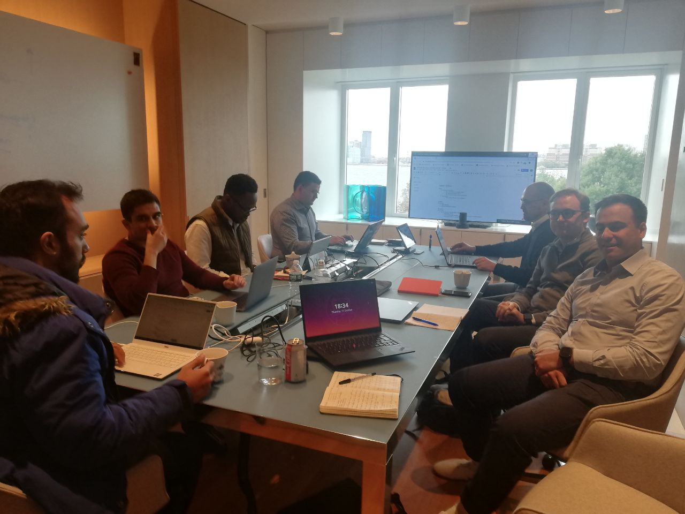
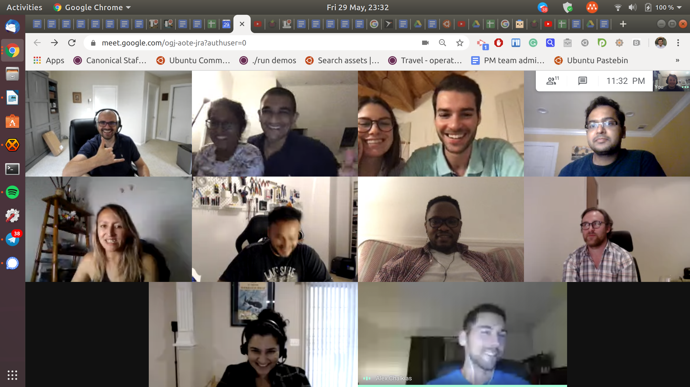
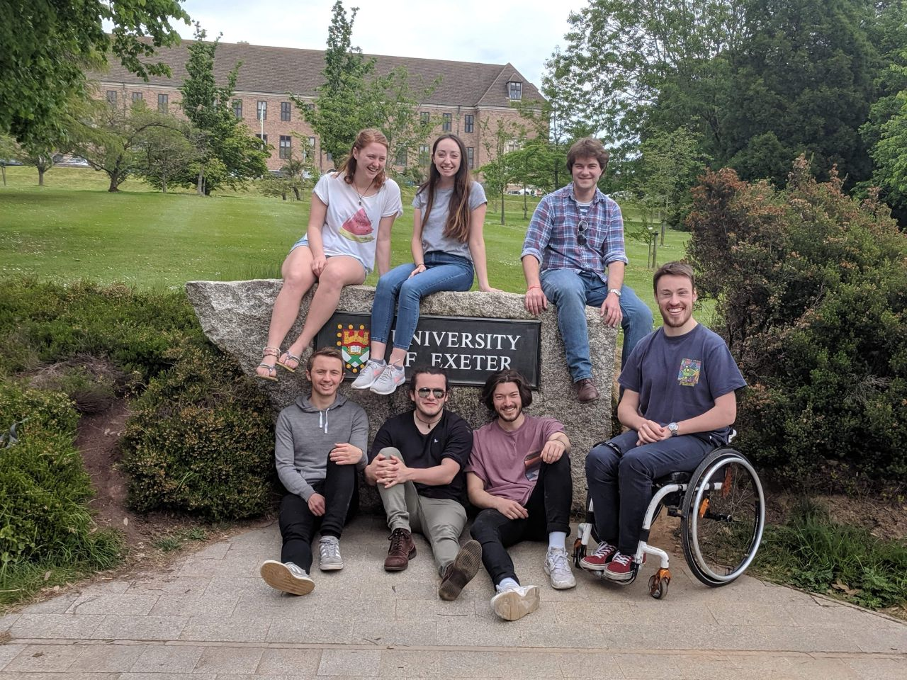
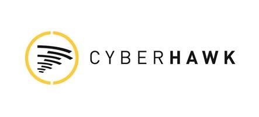
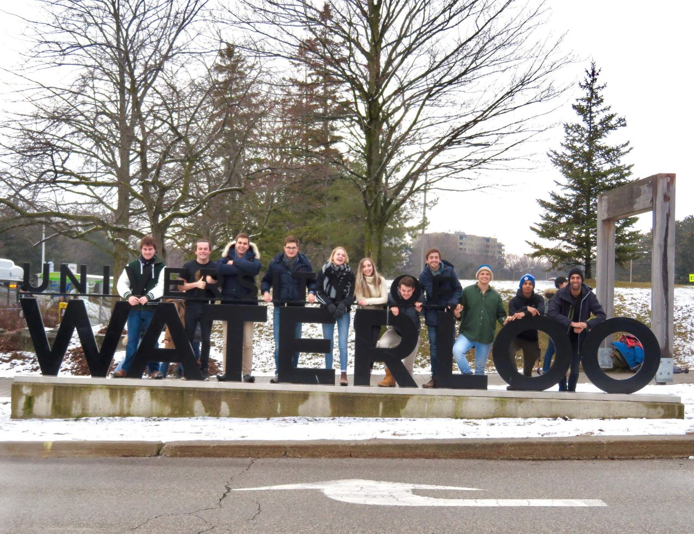
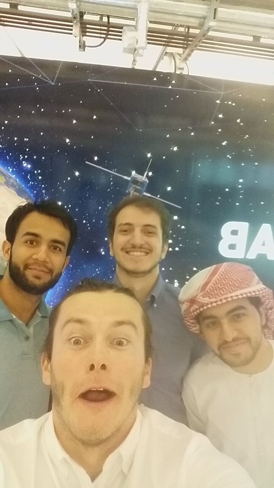
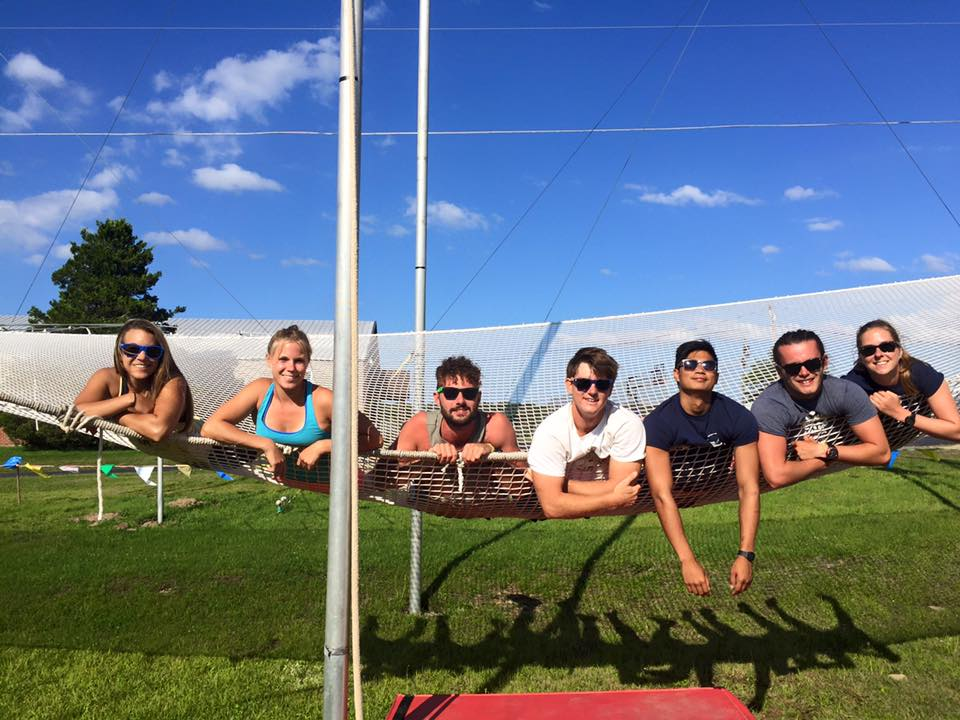

## Hello there 👋  what can I do for you?

- 🔭 I’m currently working on [Ubuntu Appliances](https://ubuntu.com/appliance), [Snapcraft](https://snapcraft.io), [Multipass](https://multipass.run), [LXD](https://linuxcontainers.org), [Ubuntu Robotics](https://ubuntu.com/robotics), [Mir](https://mir-server.io) and [Raspberry Pi initiatives](https://ubuntu.com/download/raspberry-pi) at [Canonical](https://canonical.com). 
- 🌱 I’m currently learning how to be a better Product Manager and some coding basics
- 👯 I’m looking to collaborate on developing new products and new businesses
- 🤔 I’m looking for help with starting an online magazine
- 💬 Ask me about anything you want
- 📫 If you to reach me I'm sure you'll find a way
- 😄 Pronouns: He/Him
- ⚡ Fun fact: I ran away with the circus. Read on to learn more. 

### Before that I work for Canonical as a Product Manager for 5 products, living in London but working remotely:

### Before that I finished a Masters in mechanical engieering and mechatronics from the University of Exeter:

### Before that I worked as an R&D engineer for a company called CyberHawk:

### Before that I studied and worked with a number of start ups in Waterloo University:

### Before that I worked as the science and technology editor for the Exepose newspaper:

### Before that I worked as an Aerospace materials engineering researcher in the Masdar Institute in Abu Dhabi:

### Before that I ran away with the circus and learnt to fly in Pennsylvania:

<!--
**rhys-the-davies/rhys-the-davies** is a ✨ _special_ ✨ repository because its `README.md` (this file) appears on your GitHub profile.
