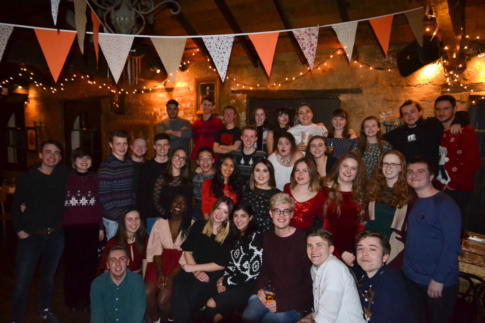

## Hello there 👋  what can I do for you?

### I am a Product Manager of Digital Climate Solutions at South Pole

- 🌱 I’m currently/always learning how to be a better Product Manager
- 📖 I write a newsletter and a book in my spare time: https://rhysthedavies.substack.com/subscribe
- 🤔 I’m a writer and story teller always looking for cool things to contribute to
- 💬 Ask me about anything you want
- 😄 Pronouns: He/Him

### Before that I work for Canonical as a Product Manager for 5 products, living in London but working remotely:

- 🔭 I worked on [Ubuntu Appliances](https://ubuntu.com/appliance), [Snapcraft](https://snapcraft.io), [Multipass](https://multipass.run), [LXD](https://linuxcontainers.org), [Ubuntu Robotics](https://ubuntu.com/robotics), [Mir](https://mir-server.io) and [Raspberry Pi initiatives](https://ubuntu.com/download/raspberry-pi) at [Canonical](https://canonical.com). 

### Before that I finished a Masters in mechanical engieering and mechatronics from the University of Exeter:

### Before that I worked as an R&D engineer for a company called CyberHawk:

### Before that I studied and worked with a number of start ups in Waterloo University:

### Before that I worked as the science and technology editor for the Exepose newspaper:

### Before that I worked as an Aerospace materials engineering researcher in the Masdar Institute in Abu Dhabi:

### Before that I ran away with the circus and learnt to fly in Pennsylvania:

<!--
**rhys-the-davies/rhys-the-davies** is a ✨ _special_ ✨ repository because its `README.md` (this file) appears on your GitHub profile.
